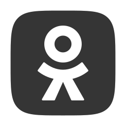

    <h2> Шаблоны ботов на базе «KarakurtAPI» </h2>
    
    
    
    
    

    Данный репозиторий представляет собой удобную библиотеку шаблонов чат-ботов для соц.сетей (Telegram,
    ВКонтакте, Discord и других), основанных на использовании <code>KarakurtAPI</code>.
    

    >> Класс <code>NeuroAI</code> - боты, которые, как правило, выполняют роль ассистентов или карманных
    помощников. Они используют AI-технологии, или их связки, для своей работы.
    <ul>
        <li> <code><a href="/Template/KnowItAll.md">KnowItAll</a></code> - шаблон генератора осмысленных текстов;    </li>
        <li> <code><a href="/Template/Desiigner.md">Desiigner</a></code> - шаблон генератора изображений/qr-кодов;   </li>
        <li> <code><a href="/Template/Chatterer.md">Chatterer</a></code> - шаблон генератора озвученного текста;     </li>
        <li> <code><a href="/Template/Musiician.md">Musiician</a></code> - шаблон генератора музыкальных треков;     </li>
        <li>                                                                                                         </li>
    </ul>
     
    

    >> Класс <code>Support</code> - боты, которые помогают пользователю в выполнении повседневных рутинных
    задач, например: сбор данных с гос. сервисов, рассылка писем, администрирование сообществ, формирование
    и публикация записей и пр.
    <ul>
        <li> <code><a href="/Template/SupPubler.md">SupPubler</a></code> - шаблон помощника в публикации постов;     </li>
        <li> <code><a href="/Template/SupPoster.md">SupPoster</a></code> - шаблон помощника в рассылки эл. писем;    </li>
        <li> <code><a href="/Template/SupParser.md">SupParser</a></code> - шаблон помощника в сборе информации;      </li>
        <li>                                                                                                         </li>
    </ul>
     
    

    >> Класс <code>Leisure</code> - боты, которые предназначены для выполнения одной единственной функции -
    развлечения пользователя, играя с ним в какие-либо игры.
    <ul>
        <li> <code><a href="/Template/PlayGamer.md">PlayGamer</a></code> - шаблон;                                   </li>
        <li>                                                                                                         </li>
    </ul>
     
    

    >> Класс <code>BizTask</code> - боты, которые нацелены на выполнение (или посильную помощь в выполнении) 
    бизнес-задач, например: сбор квиз-анкет, предоставление базы знаний пользователям.  
    <ul>
        <li> <code><a href="/Template/Direcktor.md">Direcktor</a></code> - шаблон контроллера всех ботов экосистемы; </li>
        <li> <code><a href="/Template/InterQuiz.md">InterQuiz</a></code> - шаблон опросника потенциальных клиентов;  </li>
        <li> <code><a href="/Template/KnownBase.md">KnownBase</a></code> - шаблон базы знаний с удобным управлением; </li>
        <li> <code><a href="/Template/Moderator.md">Moderator</a></code> - шаблон модератора группы/чата/сообщества; </li>
        <li> <code><a href="/Template/WebMarket.md">WebMarket</a></code> - шаблон веб-маркета в социальных сетях;    </li>
        <li>                                                                                                         </li>
    </ul>
     
    

    >> Класс <code>Combine</code> - боты, представляющие собой комбинации различных функций и фич из других
    разделов. Эти боты являются наиболее гибкими для бизнеса и наиболее дорогими в разработке, т.к. они
    вобрали в себя все полезные возможности.
    <ul>
        <li>                                                                                                         </li>
    </ul>
     
    

    >> Класс <code>EtcBots</code> - иные шаблоны ботов, не подходящие под общую классификацию.
    <ul>
        <li> <code><a href="/Template/CrashTest.md">CrashTest</a></code> - шаблон-испытатель, для демонстрации фич;  </li>
        <li>                                                                                                         </li>
    </ul>
     
    

    Дополнительные возможности для всех шаблонов:
    <ul>
        <li>
            Авторизация и разделение уровней доступа по пин-коду;
        </li>
        <li>
            Введение в работу бота команд вида <code>/prompt</code> для выполнения каких-либо действий;
        </li>
        <li>
            Введение в работу бота команд вида <code>\prompt</code> для выполнения каких-либо действий;
        </li>
        <li>
            Введение в работу бота команд вида <code>!prompt</code> для выполнения каких-либо действий;
        </li>
        <li>
            Ведение работы с собственной "локальной" базой данных, либо с онлайн-базами данных (sql);
        </li>
    </ul>
    

    <code>KarakurtAPI</code>

