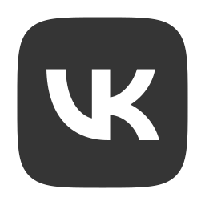

    <h1> Шаблон «Desiigner» </h1>
    
    
    
    
     
    <kbd><a href="../ReadMe.md">< Вернуться к списку шаблонов ></a></kbd>
    

    Шаблон бота, использующего нейросеть для исполнения различных задач. Например, создания изображений (или qr-кодов) по запросу пользователя или
    рисования изображений для публикации в соц.сетях. Может использовать модели: <code>LeonardoAI</code> или <code>QuickqrArt</code>.

 

<pre lang="Python">
    from KarakurtAPI.OpenAPIs import Medianet
    
    Key = "0123456789:AAAAAAAAAAAAAAAAAAAAAAAAAAAAAAAAAAA"
    Bot = Medianet.BotsTG(Key)
    
    while True:
        for Event in Bot.getEvents():
            ...
</pre>

     
    

    <samp>KarakurtAPI</samp>

